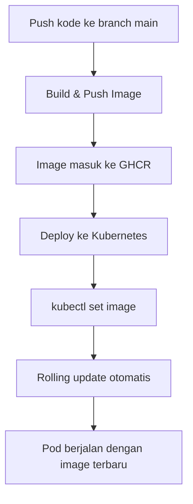
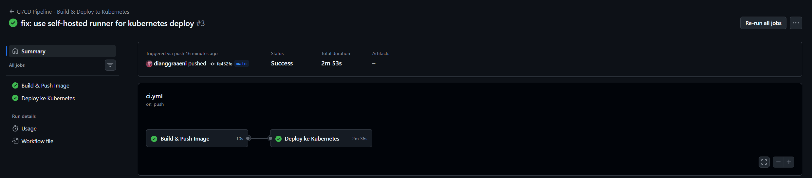
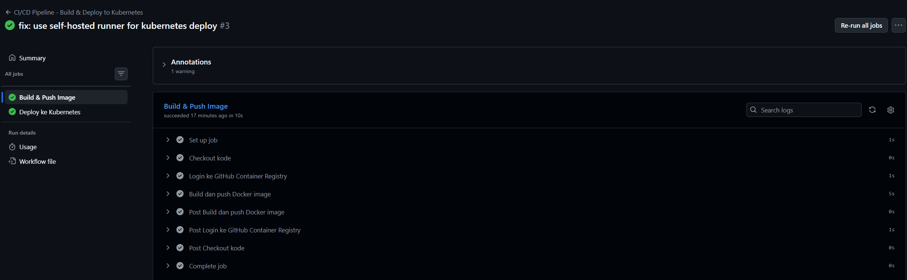
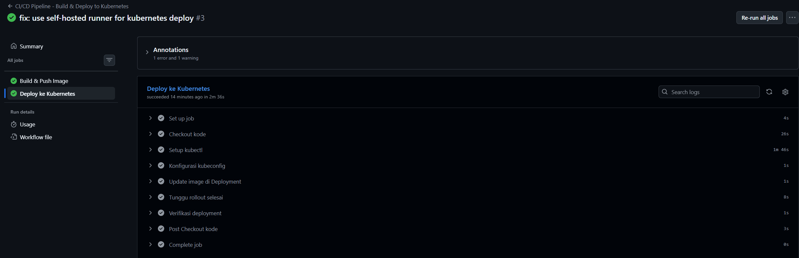
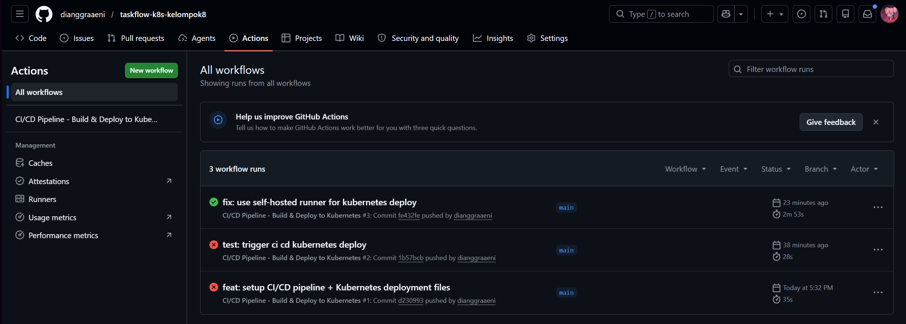
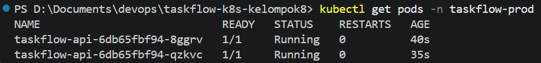
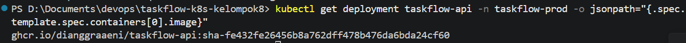

# CI/CD Pipeline ke Kubernetes

> **Status:** Berhasil diuji. Pipeline GitHub Actions dapat melakukan build image ke GHCR dan deploy otomatis ke Kubernetes menggunakan self-hosted runner.

## Tujuan

Dokumen ini membuktikan bahwa pipeline CI/CD sudah terhubung dengan cluster Kubernetes. Setelah developer melakukan push ke branch `main`, GitHub Actions akan membuat Docker image baru, mengirimkannya ke GHCR, lalu memperbarui image pada Deployment `taskflow-api` di namespace `taskflow-prod`.

## Alur Deployment



## Bukti Pipeline Berhasil

Workflow berjalan dari push ke branch `main` dan kedua job utama berhasil.



Job `Build & Push Image` berhasil membuat dan mengirim Docker image ke GHCR.



Job `Deploy ke Kubernetes` berhasil memperbarui Deployment di cluster.



Workflow dijalankan dari commit terbaru di branch `main`.



## Verifikasi di Kubernetes

Setelah job deploy selesai, Pod di namespace `taskflow-prod` berjalan normal.

```powershell
kubectl get pods -n taskflow-prod
```



Image yang berjalan di Deployment juga sudah menggunakan tag SHA dari commit terbaru.

```powershell
kubectl get deployment taskflow-api -n taskflow-prod -o jsonpath="{.spec.template.spec.containers[0].image}"
```



Hasil tersebut membuktikan bahwa perubahan dari GitHub Actions benar-benar masuk ke Kubernetes.

## Jawaban Singkat

### Apa yang terjadi jika job build gagal?

Job deploy tidak akan berjalan karena workflow menggunakan `needs: build`. Kubernetes tetap menjalankan versi aplikasi sebelumnya yang masih stabil.

### Mengapa memakai `needs: build`?

`needs: build` memastikan deploy hanya berjalan setelah image berhasil dibuat dan dipush ke GHCR. Dengan begitu, Kubernetes tidak mencoba menarik image yang belum tersedia.

### Apa bedanya dengan deploy manual?

Pada cara manual, developer harus SSH ke server, pull image, stop container, lalu menjalankan container baru. Dengan CI/CD, developer cukup push ke `main`; proses build, push image, dan update Deployment dilakukan otomatis.

## Konfigurasi yang Digunakan

| Komponen | Keterangan |
|---|---|
| `KUBECONFIG_BASE64` | Secret GitHub berisi kubeconfig Minikube dalam format base64 |
| `GITHUB_TOKEN` | Token bawaan GitHub Actions untuk push image ke GHCR |
| `self-hosted runner` | Runner lokal di laptop agar job deploy bisa mengakses cluster Minikube |
| `needs: build` | Menjamin deploy hanya berjalan jika build berhasil |

Catatan: job deploy menggunakan `self-hosted runner` karena Minikube berjalan secara lokal di laptop. Jika deploy dijalankan di `ubuntu-latest`, runner GitHub tidak dapat mengakses sertifikat dan endpoint Minikube lokal.
