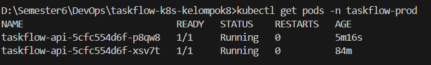
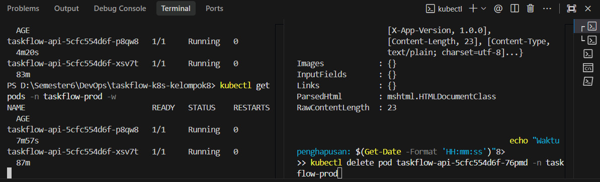
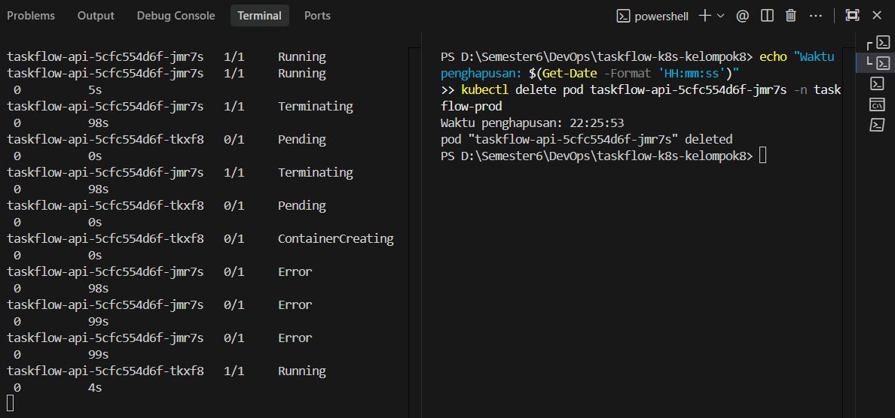
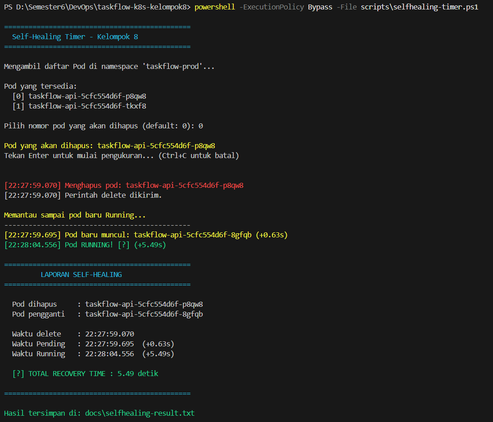

# Insiden 1 — Self-Healing: Pod Restart Otomatis

---

## Latar Belakang

> **Insiden 1** — Container crash jam 02.15 malam. Tidak ada yang tahu sampai klien komplain jam 08.30 pagi. **Downtime 6 jam lebih.**

Penyebab: tidak ada sistem otomatis yang memantau dan merestart container yang crash.

---

## Solusi: Self-Healing di Kubernetes

Kubernetes menjaga jumlah Pod sesuai `replicas` yang didefinisikan. Jika ada Pod yang mati, **Deployment Controller langsung membuat Pod pengganti secara otomatis** — tanpa intervensi manusia, 24/7.

---

## Langkah Demonstrasi

### Prasyarat

Pastikan Pod sudah Running:

```powershell
kubectl get pods -n taskflow-prod
```


### Terminal 1 — Monitor Pod (biarkan terbuka)

```powershell
kubectl get pods -n taskflow-prod -w
```


### Terminal 2 — Hapus Pod & Ukur Waktu

```powershell
# Catat waktu penghapusan
echo "Waktu penghapusan: $(Get-Date -Format 'HH:mm:ss')"

# Hapus salah satu pod
kubectl delete pod <nama-pod> -n taskflow-prod
```


Atau gunakan script pengukur waktu self-healing:

```powershell
powershell -ExecutionPolicy Bypass -File scripts\selfhealing-timer.ps1
```

---

## Hasil Pengujian

| Keterangan | Nilai |
|------------|-------|
| **Pod yang dihapus** | `taskflow-api-5cfc554d6f-p8qw8` |
| **Waktu Pod dihapus** | `22:27:59.070` |
| **Pod baru pertama muncul** | `22:27:59.695` (+0.63s) |
| **Pod baru Running** | `22:28:04.556` (+5.49s) |
| **Total waktu recovery** | **~5 detik** |

---

## Kesimpulan

| | Cara Lama | Dengan Kubernetes |
|-|-----------|-------------------|
| **Deteksi crash** | Manual / tidak ada | Otomatis, instan |
| **Waktu recovery** | ~6 jam (tunggu engineer) | **~5 detik** |
| **Intervensi manusia** | Diperlukan | Tidak diperlukan |

**Insiden 1 tidak akan terjadi lagi.** Kubernetes membuat Pod pengganti dalam hitungan detik — jauh sebelum ada klien yang sempat merasakan gangguan.
